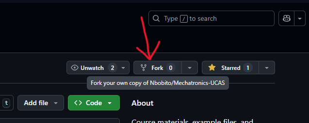
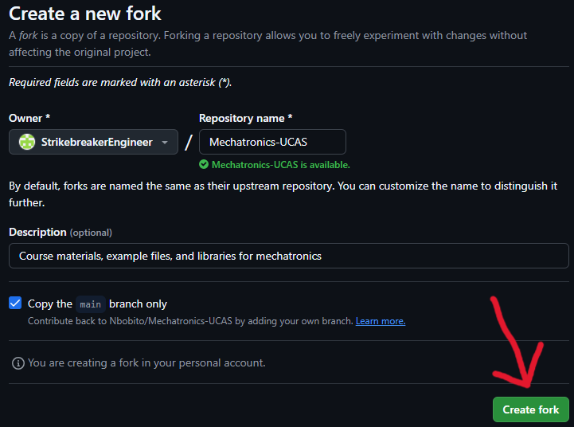
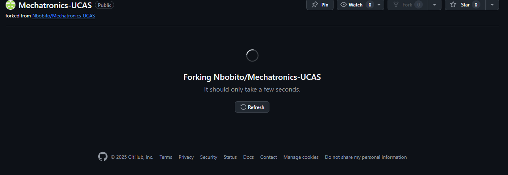
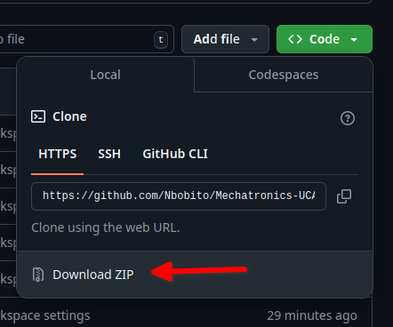
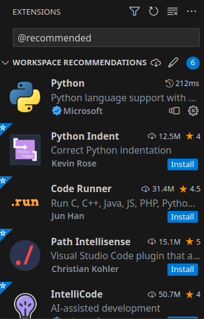

# Mechatronics-UCAS
Course materials, example files, and libraries for mechatronics


## Introduction

To set up this class workspace, start by creating a GitHub account. Then fork ("copy") this main Mechatronics repository into your account.

To fork the Repository, start by selecting the `Fork` option at the top of the screen:



It will then take you to the specifics page. Make sure that the new `Owner` of the forked repo is your account, and that your chosen `Repository name` (default is "Mechatronics-UCAS") is available. Also ensure that the `Copy the main branch only` option is selected. Once this is done, create your fork:



GitHub will then Fork the Repository over to your account. This may take a significant amount of time:



Now, you should have your own copy of the "Mechatronics-UCAS" Repository in your pages. 

**Follow the rest of this guide while inside your copy of the Repository!**

You can ensure that you are in your fork by looking at the top of the code page, where it will have the forking information:


### PC Cloning Instructions
Now, to get the files onto your computer, simply clone this repository by pressing `Windows + R`, entering `cmd`, then pasting in and running:
```
cd Documents
git clone https://github.com/Nbobito/Mechatronics-UCAS.git  
```

Alternatively, if you get an error, just download the zip file and extract:



Once the files are downloaded, open vscode. Press `Ctrl + Shift + P` to open the command pallet, and enter `file open folder`, at which point you can select the repository folder. If a security notice pops up, select the option to trust authors. As a note, if you used git to download the repository, it should be in the `Documents` folder. After you open it, press `Ctrl + Shift + E` or click the file icon on the left side panel to open the explorer. It should look something like this:


If it looks like this, you need to go one more folder down:


You might see some errors or notices pop up, just ignore them for now.

Now that you're in the correct folder, you'll need to install some extensions. Press `Ctrl + Shift + X`, and type `@recommended` in the search box on the side panel. Install all of the extensions listed:



At this point you need to install and set up the python environment. Press `Ctrl + ` ` to open a terminal, then enter
```
python -m venv .venv; .\.venv\Scripts\pip.exe install -r requirements.txt
```
Once again, just exit out of and ignore any pop-ups.

Once the command finishes running, open the command pallet again and enter `python select interpreter`. 

Select the option that is recommended, as shown below:


Lastly, to make sure your terminal is in the correct environment, simply click the trash icon at the top right of the terminal, then press `Ctrl + ` ` to open a new one.


**You've finished setup!!!**

## (Very) Useful Resources
- W3 Schools python [tutorial](https://www.w3schools.com/python/)
- Djitellopy library [documentation](https://djitellopy.readthedocs.io/en/latest/tello/)
- Mechatronics-UCAS github [link](https://github.com/Nbobito/Mechatronics-UCAS)